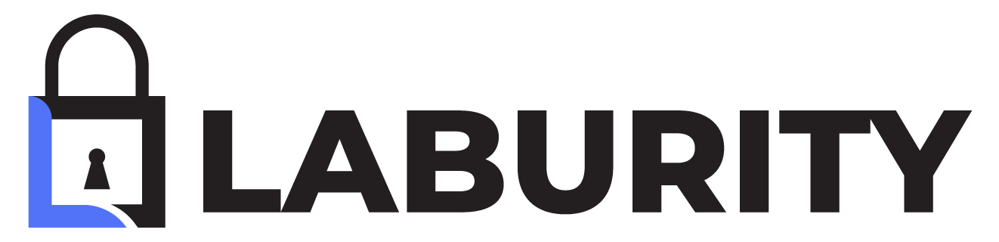

  

  
  &nbsp;
  
  &nbsp;
  

<i>Offensive Security. Cyber Security. Research-Driven. Dark Web Monitoring.</i>

---

## 🔍 About Us  
Laburity is a global cybersecurity company specializing in offensive security, red teaming, and security research. Our team has reported critical CVEs, developed open-source tools, and presented at global security conferences. Trusted by enterprises and startups alike, we help secure digital ecosystems end-to-end. We also provide Dark and Deep web monitoring because of our in-depth research.

### 🌍 Company Presence  
🇦🇪 United Arab Emirates | 🇬🇧 United Kingdom | 🇺🇸 United States  

---

## 🧪 CVEs & Research  
Some of the Security vulnerabilities and technical research shared with the wider community.

### CVEs

| CVE ID | Year | Severity | Description |
|--------|------|----------|-------------|
| [CVE-2022-28481](https://nvd.nist.gov/vuln/detail/CVE-2022-28481) | 2022 | Critical | CSV-Safe gem < 3.0.0 doesn't filter out special characters which could trigger CSV Injection. |
| [CVE-2022-1556](https://nvd.nist.gov/vuln/detail/CVE-2022-1556) | 2022 | Critical | The StaffList WordPress plugin before 3.1.5 does not properly sanitise and escape a parameter before using it in a SQL statement when searching for Staff in the admin dashboard, leading to an SQL Injection |
| [CVE-2022-1390](https://nvd.nist.gov/vuln/detail/CVE-2022-1390) | 2022 | Critical | The Admin Word Count Column WordPress plugin through 2.2 does not validate the path parameter given to readfile(), which could allow unauthenticated attackers to read arbitrary files on server running old version of PHP susceptible to the null byte technique. This could also lead to RCE by using a Phar Deserialization technique |
| [CVE-2024-11638](https://www.wordfence.com/threat-intel/vulnerabilities/wordpress-plugins/gtbabel/gtbabel-668-unauthenticated-cookie-stealing) | 2024 | High | The Gtbabel plugin for WordPress is vulnerable to cookie stealing in all versions up to, and including, 6.6.8. This is due to the plugin transmitting cookie data via a URL. This makes it possible for unauthenticated attackers to steal admin cookies which may make privilege escalation possible, if they can successfully trick in administrator into clicking a link. |
| [CVE-2022-25523](https://nvd.nist.gov/vuln/detail/CVE-2022-25523) | 2022 | High | TypesetterCMS v5.1 was discovered to contain a Cross-Site Request Forgery (CSRF) which is exploited via a crafted POST request. |
| [CVE-2023-6777](https://nvd.nist.gov/vuln/detail/CVE-2023-6777) | 2023 | Medium | The WP Go Maps (formerly WP Google Maps) plugin for WordPress is vulnerable to unauthenticated API key disclosure in versions up to, and including, 9.0.34 due to the plugin adding the API key to several plugin files.. |
| [CVE-2022-1558](https://nvd.nist.gov/vuln/detail/CVE-2022-1558) | 2022 | Medium | The Curtain WordPress plugin through 1.0.2 does not sanitise and escape some of its settings, which could allow high privilege users such as admin to perform Stored Cross-Site Scripting attacks when the unfiltered_html capability is disallowed |
| [CVE-2024-11921](https://www.wordfence.com/threat-intel/vulnerabilities/wordpress-plugins/give/givewp-donation-plugin-and-fundraising-platform-3180-reflected-cross-site-scripting) | 2024 | Medium | GiveWP – Donation Plugin and Fundraising Platform <= 3.18.0 - Reflected Cross-Site Scripting |
| [CVE-2022-1559](https://nvd.nist.gov/vuln/detail/CVE-2022-1559) | 2022 | Medium | The Clipr WordPress plugin through 1.2.3 does not sanitise and escape its API Key settings before outputting it in an attribute, leading to a Stored Cross-Site Scripting issue even when the unfiltered_html capability is disallowed |
| [CVE-2025-1288](https://www.wordfence.com/threat-intel/vulnerabilities/wordpress-plugins/wooexim/wooexim-woocommerce-export-import-plugin-500-reflected-cross-site-scripting) | 2025 | Medium | WOOEXIM – WooCommerce Export Import Plugin <= 5.0.0 - Reflected Cross-Site Scripting |

### Further Research & Articles

| Title | Link |
|-------|------|
| **How to find NPM dependencies vulnerable to account hijacking** | [Read](https://www.theregister.com/2022/05/23/npm_dependencies_vulnerable/) |
| **Research Case Study: Supply Chain Security at Scale – Insights into NPM Account Takeovers** | [Read](https://laburity.com/research-npm-account-takeovers/) |
| **Vulnerability Research** | [Read](https://github.com/Laburity/vulnerability-research) |
| **Rails Research** | [Read](https://github.com/Laburity/rails-research) |
| **Further Centralized Vulnerabilities Database of Hassan Khan, Director, Laburity** | [Read](https://www.wordfence.com/threat-intel/vulnerabilities/researchers/hassan-khan-yusufzai) |

---

## 🔧 Open Source Tools  
Some of the Security tools we have built and released for the community.

| Tool Name | Description |
|-----------|-------------|
| [npm-account-hijacking-scanner](https://github.com/Laburity/npm-account-hijacking-scanner) | Identify NPM dependencies vulnerable to account hijacking  |
| [vulnerable-IDOR-lab](https://github.com/Laburity/vulnerable-IDOR-lab) | A vulnerable PHP based IDOR lab for vulnerability practice and learning  |
| [seekrets-oss](https://github.com/Laburity/seekrets-oss) | Seekerts - A Supply Chain Secret Scanning tool that detects hidden secrets inside code ;)  |
| [s1domains](https://github.com/Laburity/s1domains) | Do subdomain scanning like agent 47  |
| [easyxss](https://github.com/Laburity/easyxss) | A simple threading-based tool to find reflection in parameters of multiple URLs for cross-site scripting identification. |
| [fraudCheck](https://github.com/Laburity/fraudCheck) | Fraud scoring tool |

---

## 📢 Public Speaking and Research  
Some of our participation in global conferences and technical knowledge sharing.

| Conference | Country | Year | Topic | Link |
|------------|---------|------|-------|------|
| Black Hat MEA | Saudi Arabia | 2023 | Secret scanning in open source at scale | [Link](https://blackhatmea.com/session/secret-scanning-open-source-scale) |
| Out of the box (OOTB) | Indonesia | 2025 | Seekrets & The NPM Account Takeover Detector | [Link](https://ootb2025jkt.ootb.net/talks/seekrets-and-npm-account-takeover-detector) |
| MCTTP (Munich Cyber Tactics Techniques and Procedures) | Germany | 2024 | Secret scanning in open source at scale (in-depth) | [Link](https://www.mcttp.de/speaker-2024) |
| HITBSecConf2024 | Thailand | 2024 | Secret Scanning in Open Source at Scale (in-depth) | [View Talk](https://www.youtube.com/watch?v=sei7u4xnsdI) |
| Ransomware Resilience | Malaysia | 2024 | Key Strategies and Best Practices in Defending Against Supply Chain & Ransomware Attacks | [Link](https://cybersecurityasia.tech/ransomware-resilience-2024/) |
| TheSaSCon | Thailand | 2023 | The Cyber Jungle Expedition: Navigating Supply Chain Attacks | [View Talk](https://www.youtube.com/watch?v=vZT6qsMIPJY) |
| Threat Con | Nepal | 2023 | Supply Chain Attacks:- Focused On NPM Attacks | [Link](https://2023.threatcon.io/agenda?track=2) |
| Black Hat MEA | Saudi Arabia | 2022 | Supply-Chain Attacks: What, Why, and How | [Link](https://web.archive.org/web/20221103013915/http://blackhatmea.com/speaker/danish-tariq) |
| Black Hat MEA | Saudi Arabia | 2022 | NPM Account Hijacking Scanner | [Link](https://web.archive.org/web/20221103013915/http://blackhatmea.com/speaker/danish-tariq) |
| DevExec World | Virtual | 2024 | Supply Chain Attacks:- Focused on NPM attacks. (Includes, demonstrations of research and prevention | [Link](https://devexecworld.com/) |
| Conf42 DevSecOps 2023 | Virtual | 2023 | Supply Chain Attacks: Focused on NPM attacks | [View Talk](https://www.conf42.com/DevSecOps_2023_Danish_Tariq_Hassan_Khan_Yusufzai_supply_chain_npm_attacks) |
| All Day Dev Ops | Virtual | 2023 | Supply Chain Attacks: JS attacks, Research, and Prevention | [Link](https://www.alldaydevops.com/addo-speakers/danish-tariq) |
| DevSecCon | Virtual | 2023 | Supply Chain Attacks - Focused on NPM attacks | [View Talk](https://www.youtube.com/watch?v=yKICfLZ61Mw) |
| EyesOpen Cybersecurity Conference | Virtual | 2023 | Supply chain attacks: Focus on JS attacks | [Link](https://eyesopensecurity.com/speaker/28) |

---

## ✍️ Blogs  
Some of our insights and educational content from our team on real-world security challenges.

| Title | Link |
|-------|------|
| **Research Case Study: Supply Chain Security at Scale – Insights into NPM Account Takeovers** | [Read](https://laburity.com/research-npm-account-takeovers/) |
| **Exploiting pfsense Remote Code Execution – CVE-2022-31814** | [Read](https://laburity.com/exploiting-pfsense-remote-code-execution-cve-2022-31814/) |
| **HTTP Request Smuggling Explained: A Beginner’s Guide on identification and mitigation.** | [Read](https://laburity.com/http-request-smuggling-explained-a-beginners-guide-on-identification-and-mitigation/) |
| **IDOR Case Study: Manipulating Billing Information and Viewing Payment History** | [Read](https://laburity.com/idor-case-study-manipulating-billing-information/) |
| **Performing Android Static Analysis 101-A Complete Guide for Beginners** | [Read](https://laburity.com/performing-android-static-analysis-101-a-complete-guide-for-beginners/) |
| **Explore Our Blog & Articles** | [Read](https://laburity.com/blog/) |

---

## 🌟 Reviews  
Take a look at what some of our clients and partners say about working with us.

| Person & Position | Company | Review |
|-------------------|---------|--------|
| Tony Chen, CTO | Passport Global | "Laburity conducted penetration testing and security assessments for our company, Passport, and we couldn't be happier with their services. Their team provided comprehensive assessments and delivered top-notch security consultancy. They went above and beyond, showcasing remarkable expertise and not just relying on automation tools. We highly recommend Laburity for any security needs." |
| Nick Dinges, CTO | Replique | "We engaged Laburity for a cybersecurity consultancy and penetration testing, and we couldn't be more impressed with the experience. The service was top-notch, delivered with remarkable speed, and exceeded our expectations. What stood out was the blend of automation with deep expertise—they didn't just rely on tools but deployed senior resources who brought incredible insight to our project. Laburity's approach was thorough, professional, and truly elevated our security posture. Highly recommended!" |
| Ark, Security Operations Engineer | Walmart | "I received the exploit you handled. I found it to be a great find and very well documented exploit. Thank you very much for that." |

---

### 🎓 Certifications & Affiliations  
Some of the Credentials, affiliations, and verifications of our team's expertise.

- Offensive Security Certified Professional (OSCP)  
- Certified Ethical Hacker (Practical)   
- Certified AppSec Practitioner  
- Fortinet NSE Associate  
- ICSI Network Security Specialist  
- eJPT
- OWASP Chapter Leader 

---

## 🛠️ Security Services Portfolio  
A summary of some of the cybersecurity services we offer to businesses and teams.

- Web & Mobile Application Penetration Testing  
- Network Vulnerability Assessments & Penetration Testing 
- Cloud Security Audits (AWS, Azure, GCP)  
- Red Teaming & Social Engineering  
- Supply Chain Risk Analysis & OSS Audits  
- Security Awareness & Developer Training  
- Compliance Alignment (SOC 2, ISO 27001, GDPR, DORA, PSTI)
- Dark & Deep Web Monitoring

---

### 🏅 Hall of Fame & Recognitions  
Acknowledgments from major organizations for our vulnerability disclosures.

Acknowledged by: Google, eBay, Apple, Microsoft, Blackberry, Nokia, and several Fortune 500 companies.

---

## 📫 Contact  
Get in touch with us for services, questions, or collaborations.

📧 contact@laburity.com  
🌐 https://laburity.com  
